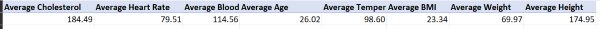
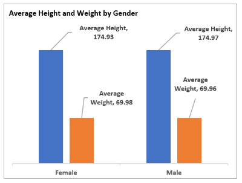
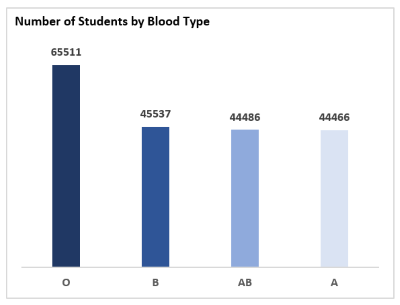
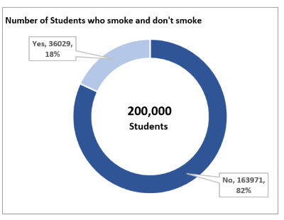
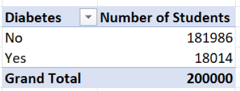

# Analysis-of-Medical-Students-Dataset-of-College-of-Medicine-,YK.
---

---
## Introduction
This analysis entails datasets of medical students from the College of Medicine, YK. It includes attributes of about 200,000 medical students such as Student ID, Age, Gender, Height, Weight, Blood Type, BMI, Temperature, Heart Rate, Blood Pressure, Cholesterol, Diabetes and smoking spread out into individual columns. 

Kindly feel free to interact with data here...(https://github.com/SeunA88/Analysis-of-Medical-Students-Dataset-of-College-of-Medicine-YK./blob/main/Med_student_initial_data.xlsx).

Analysis of this data was carried out to acquire some useful insights from the dataset. Firstly, each column was formatted to depict the data therein. The following insights were obtained from the data using Pivot tables in Excel:

1. 	Average Cholesterol, Heart rate, Blood pressure, Age, Temperature, BMI, Weight, and Height of students.
2.	Average Height and Weight by Gender.
3.  Number of Students by Blood Type.
4.  Number of Students who smoke and those who don’t.
5.  Number of Students who have diabetes and those who don’t.

These acquired insights were further displayed with various visualization tools in Excel. Please find below each pivot table analysis alongside their visuals.

---

## Result of Analysis
-	Average Cholesterol, Heart rate, Blood pressure, Age, Temperature, BMI, Weight, and Height of students.
This was determined using the AVERAGE function in the pivot table "Value" field for each criteria/attribute. A column chart was used to visualize all the insights generated from this analysis.

  
 
**Analysis Insight**: This analyisis shows some important medical insights of the students. Noteworthy is the average blood pressure, heart rate and cholesterol level of students (184.49, 79.51, 114.56 respectively)  which are vital pieces of information. 

--- 

-	Average Height and Weight by Gender.
This was determined using the AVERAGE function in the pivot table "Value" field for each criteria/attribute, with the gender in the "Row" field. A Column chart was used to visualize the insight generated.

  
                  
---
Analysis Insight: 

-	Number of Students by Blood Type.
This was determined using the COUNT function in the pivot table "Value" field for number of students, with the blood type in the "Row" field. A Column chart was used to view the generated insight.

 

**Analysis Insight**: This analysis shows that Blood Type O is the most observed blood type among the students with a total number of 65,511 students out of 200,000 students having this blood type. The number of students with the other three blood types was almost uniformly spread across the remaining students.

---

-	Number of Students who smoke and those who don’t.
This was determined using the COUNT function in the pivot table "Value" field for number of students, with the Smoking data in the "Row" field. A Doughnut chart was used to visualize the insight.

 

**Analysis Insight**: From this analysis, it can be seen that a high number/percentage of student do not smoke, 163,971, 82% out of a total of 200,000 students.

---

-	Number of Students who have diabetes and those who don’t.
This was determined using the COUNT function in the pivot table "Value" field for number of students, with the Diabetes data in the "Row" field. A Doughnut chart was also used to visualize the insight.

 

**Analysis Insights**: From this analysis, it can be seen that a high number/percentage of student do not have diabetes 181,986 , 91% out of a total of 200,000 students.

---

## Conclusion
Using pivot table and charts in Excel, insights have been generated from Medical Student Dataset of College of Medicine, YK which will give rise to a better understanding of the students' profile and help the student administrators to make meaningfull and informed decisions.

